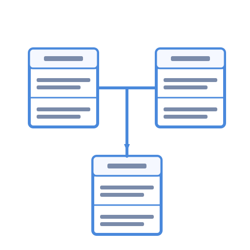
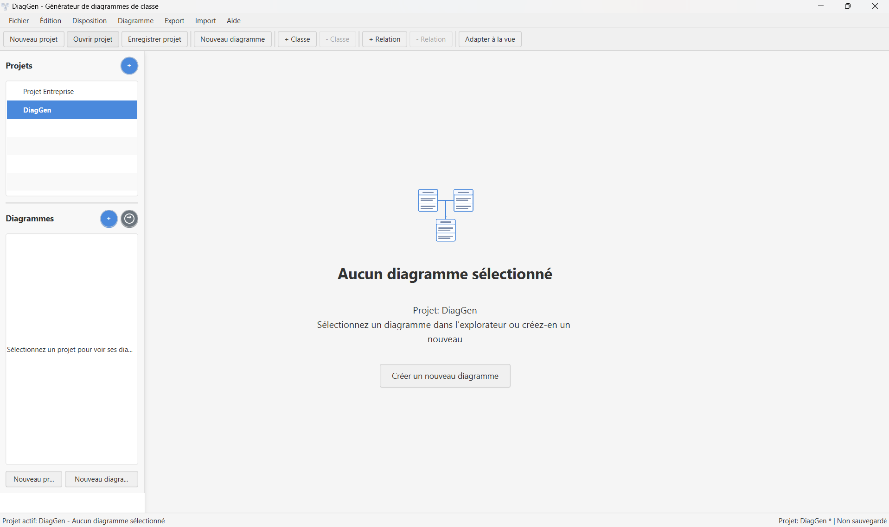
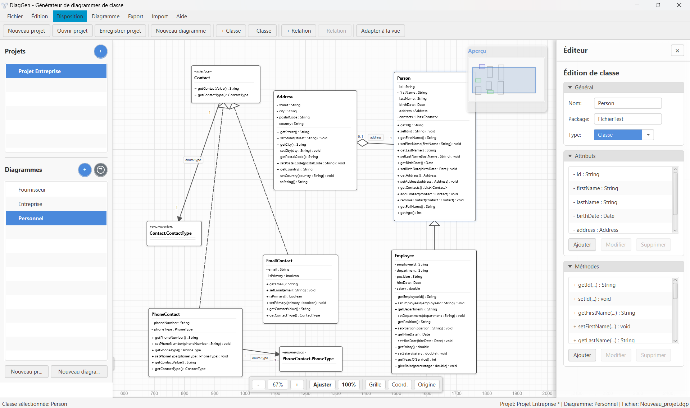

# DiagGen - Générateur de diagrammes de classe UML



DiagGen est une application Java moderne permettant de créer, éditer et exporter des diagrammes de classe UML de façon intuitive et efficace.

## Fonctionnalités

- Création de diagrammes de classe UML
- Support complet des relations (association, agrégation, composition, héritage, implémentation, dépendance)
- Génération de code Java à partir des diagrammes
- Import de code Java existant pour créer des diagrammes
- Organisation automatique des diagrammes avec plusieurs algorithmes de layout
- Export vers PNG, SVG et PlantUML
- Gestion de projets multi-diagrammes
- Interface utilisateur intuitive basée sur JavaFX

## Captures d'écran




## Installation

### Prérequis

- Java 21 ou supérieur

### Téléchargement

Téléchargez la dernière version de DiagGen depuis la [page des releases](https://github.com/korban2u/diaggen/releases).
### Installation selon votre système

#### Windows
- Exécutez le fichier .msi et suivez les instructions d'installation.
- Vous pourrez choisir le répertoire d'installation pendant le processus.

#### macOS
- Montez le fichier .dmg et glissez DiagGen dans votre dossier Applications ou tout autre dossier de votre choix.

#### Linux
- Installez le package .deb avec `sudo dpkg -i diaggen_1.0.0.deb`
- Ou le package .rpm avec `sudo rpm -i diaggen-1.0.0.rpm`
- Pour une installation personnalisée, utilisez la version tar.gz avec le script d'installation inclus.

## Utilisation

### Démarrage

Lancez DiagGen depuis votre menu d'applications ou l'icône du bureau.

### Création d'un diagramme

1. Créez un nouveau projet via `Fichier > Nouveau projet`
2. Ajoutez un diagramme via `Fichier > Nouveau diagramme`
3. Ajoutez des classes avec le bouton `+ Classe` ou via `Diagramme > Ajouter une classe`
4. Créez des relations avec le bouton `+ Relation`

### Import de code Java

Vous pouvez importer du code Java existant via `Import > Importer du code Java...`

### Export du diagramme

Plusieurs formats d'export sont disponibles via le menu `Export`:
- PNG
- SVG
- PlantUML
- Code Java

## Raccourcis clavier

| Action | Raccourci |
|--------|-----------|
| Nouveau projet | Ctrl+Shift+N |
| Nouveau diagramme | Ctrl+N |
| Enregistrer | Ctrl+S |
| Enregistrer sous | Ctrl+Shift+S |
| Ajouter une classe | Ctrl+Alt+N |
| Supprimer l'élément sélectionné | Delete |
| Annuler | Ctrl+Z |
| Rétablir | Ctrl+Y |
| Zoom avant | Ctrl+= |
| Zoom arrière | Ctrl+- |
| Réinitialiser le zoom | Ctrl+0 |
| Adapter à la vue | Ctrl+F |

## Développement

### Prérequis

- JDK 21
- Maven 3.8+
- JavaFX 21

### Compilation

```bash
mvn clean install
```

### Exécution en mode développement

```bash
mvn javafx:run
```

### Création d'un package d'installation

```bash
# Windows
package.bat

# macOS/Linux
./package.sh
```

## Technologies utilisées

- Java 21
- JavaFX 21
- JavaParser
- ControlsFX
- Maven

## Licence
[](https://opensource.org/licenses/MIT)

Ce projet est sous licence [MIT](LICENSE).

## Auteur

- Ryan Korban
